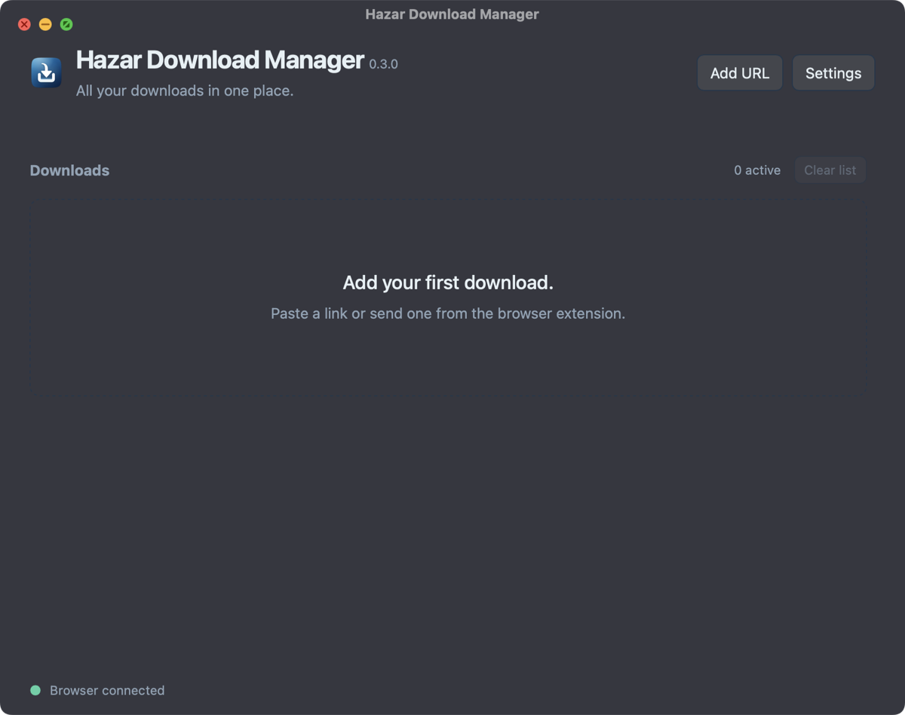
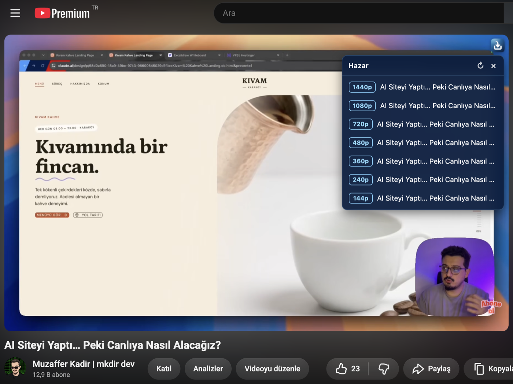

<p align="center">
  
</p>

<h1 align="center">Hazar Download Manager</h1>

<p align="center">
  A fast, lightweight download manager for macOS and Windows —<br />
  multi-connection downloads, HLS/DASH streams, and one-click video capture from your browser.
</p>

<p align="center">
  <a href="https://github.com/muzafferkadir/hazar/releases/latest"></a>
  
  <a href="LICENSE"></a>
</p>

<p align="center">
  
</p>

## Install

**macOS**

```bash
curl -fsSL https://raw.githubusercontent.com/muzafferkadir/hazar/main/install.sh | bash
```

**Windows** (PowerShell)

```powershell
irm https://raw.githubusercontent.com/muzafferkadir/hazar/main/install.ps1 | iex
```

Or grab the DMG / installer from [Releases](https://github.com/muzafferkadir/hazar/releases/latest).

**Browser extension**: in the app open **Settings → Save extension**, then in Chrome/Edge go to `chrome://extensions` → enable *Developer mode* → **Load unpacked** and pick the saved folder.

## Features

- ⚡ **Multi-connection downloads** — segmented HTTP(S) with resume, retries and optional SHA-256 check.
- 🎬 **Streams** — HLS (AES-128, separate audio) and DASH, merged to MP4 with bundled FFmpeg. No re-encode.
- ▶️ **YouTube & 1000+ sites** — bundled yt-dlp; pick the quality (2160p … 144p) right on the video.
- 🧩 **Browser capture** — a small Hazar button on every video, context menu, and automatic download takeover with cookies/referer.
- 🌗 **Native feel** — macOS vibrancy, light/dark mode, menu bar mode, English and Turkish UI.

<p align="center">
  
</p>

## Limits

No DRM, live recording or multi-period DASH. The extension is distributed unpacked (no store release yet). macOS builds are ad-hoc signed.

## Development

```bash
pnpm install
pnpm tauri dev                     # run the app
cargo test --workspace             # engine tests
pnpm check && pnpm check:extension && pnpm test:extension
```

Release: `bash scripts/bump-version.sh <version>`, commit, then push a `v<version>` tag — CI builds the macOS DMG, Windows installer, updater files and extension zip.

[Changelog](CHANGELOG.md) · [License](LICENSE)
